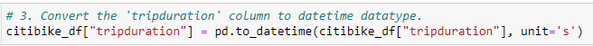
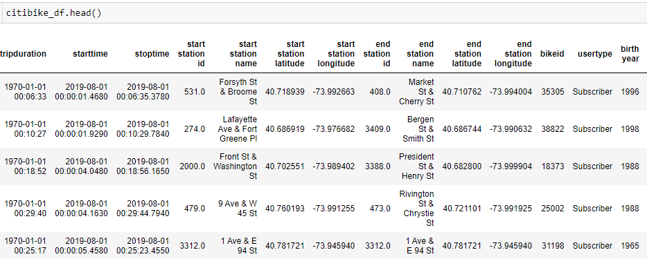
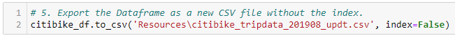
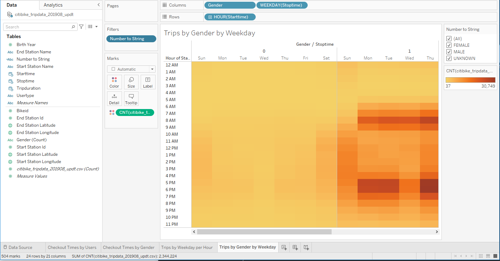
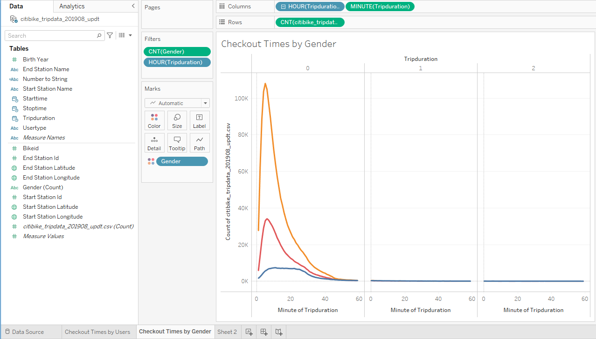
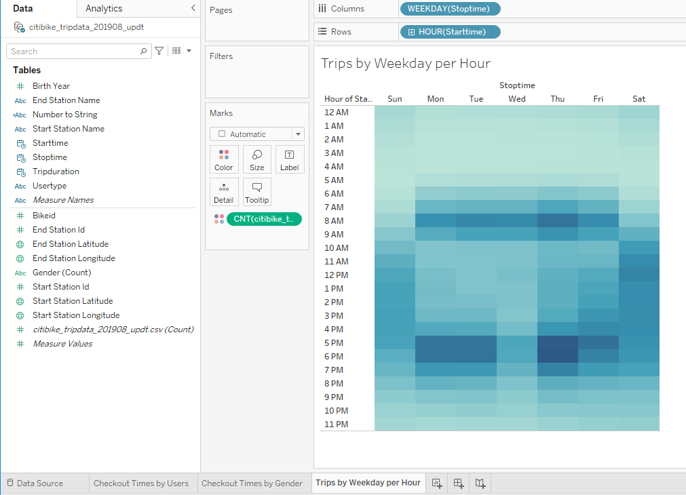

# bikesharing

## Background
Now that we've gotten a good idea of how to create our story, there is still some more work to be done to convince investors that a bike-sharing program in Des Moines is a solid business proposal. To solidify the proposal, one of the key stakeholders would like to see a bike trip analysis.

For this analysis, you’ll use Pandas to change the "tripduration" column from an integer to a datetime datatype. Then, using the converted datatype, you’ll create a set of visualizations to:

- Show the length of time that bikes are checked out for all riders and genders
- Show the number of bike trips for all riders and genders for each hour of each day of the week
- Show the number of bike trips for each type of user and gender for each day of the week.
- Finally, you’ll add these new visualizations to the two you created in this module for your final presentation and analysis to pitch to investors.

### Deliverable 1: Change Trip Duration to a Datetime Format

Using Python and Pandas functions, you’ll convert the "tripduration" column from an integer to a datetime datatype to get the time in hours, minutes, and seconds (00:00:00). After you convert the "tripduration" column to a datetime dataytpe, you’ll export the DataFrame as a CSV file to use for the trip analysis in Deliverable 2.

Confirm that the data in the "tripduration" column is converted to a datetime datatype and has the correct time format:

The DataFrame is exported as a new file without the index column:

## Deliverable 2: Create Visualizations for the Trip Analysis

Using Tableau, create visualizations that show:

- How long bikes are checked out for all riders and genders.
- How many trips are taken by the hour for each day of the week, for all riders and genders.
- A breakdown of what days of the week a user might be more likely to check out a bike, by type of user and gender.

### Checkout Times by All Users:

### Checkout Times by Gender:

### Trips by Weekday for Each Hour Viz

### Trips by Gender (Weekday per Hour) Viz

