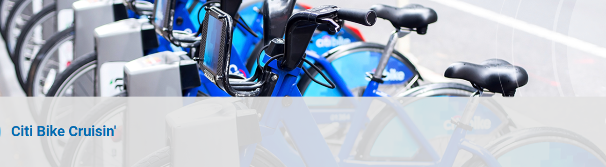

# bikesharing

## Background
Now that we've gotten a good idea of how to create our story, there is still some more work to be done to convince investors that a bike-sharing program in Des Moines is a solid business proposal. To solidify the proposal, one of the key stakeholders would like to see a bike trip analysis.

For this analysis, you’ll use Pandas to change the "tripduration" column from an integer to a datetime datatype. Then, using the converted datatype, you’ll create a set of visualizations to:

- Show the length of time that bikes are checked out for all riders and genders
- Show the number of bike trips for all riders and genders for each hour of each day of the week
- Show the number of bike trips for each type of user and gender for each day of the week.
- Finally, you’ll add these new visualizations to the two you created in this module for your final presentation and analysis to pitch to investors.

### Deliverable 1: Change Trip Duration to a Datetime Format

Using Python and Pandas functions, you’ll convert the "tripduration" column from an integer to a datetime datatype to get the time in hours, minutes, and seconds (00:00:00). After you convert the "tripduration" column to a datetime dataytpe, you’ll export the DataFrame as a CSV file to use for the trip analysis in Deliverable 2.

Confirm that the data in the "tripduration" column is converted to a datetime datatype and has the correct time format:

The DataFrame is exported as a new file without the index column:

## Deliverable 2: Create Visualizations for the Trip Analysis

Using Tableau, create visualizations that show:

- How long bikes are checked out for all riders and genders.
- How many trips are taken by the hour for each day of the week, for all riders and genders.
- A breakdown of what days of the week a user might be more likely to check out a bike, by type of user and gender.

### Checkout Times by All Users:

### Checkout Times by Gender:

### Trips by Weekday for Each Hour Viz

### Trips by Gender (Weekday per Hour) Viz

### Trips by Gender by Weekday Viz

## Deliverable 3: Create a Story and Report for the Final Presentation

Using table public we have created the report visualization to support our findings. This report can be found at:

[link to dashboard](https://public.tableau.com/views/NYCCitibike-Ride/NYCStory?:language=en-US&publish=yes&:display_count=n&:origin=viz_share_link)

- It was identified that there were 2,344,224 bike trips that were recorded during the month of August. 

- Out of those trips, 81% percent belongs to existing service subcribers wereas are the remaining 20 percent are casual users, defining a strong bussines base of regular customers.

- Peak times for initiating trips start ~ 4:00 PM to 7:00 PM. This is the time windows were most bikes are requiered.

- Maintenance hours are best carried around 2:00 AM to 4:00 AM were bike usage numbers are the lowest.

- Two more visualizations are needed to determine the correct distribution to start the bike trips and to define collection points for ending trips to provide better and more efficiet logistics.

### Top Starting Locations

### Find Top Ending Locations

